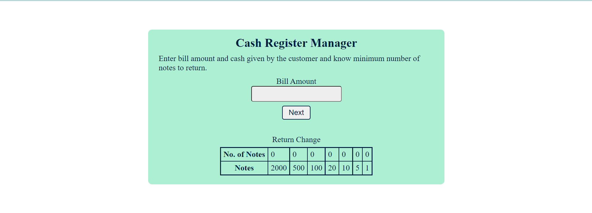

# Cash-register-vanillajs

# What is this app about??

This api is created using html css and javascript It gives how much rupees is remainig to give and how much given.
It will distribute how much amount of note is remaining to give in notes.

# Technologies used
- HTML
- CSS
- JavaScript

# Please check attach screenshot

# Please check demo of app
[Demo](https://cash-register-calculate.netlify.app/)
